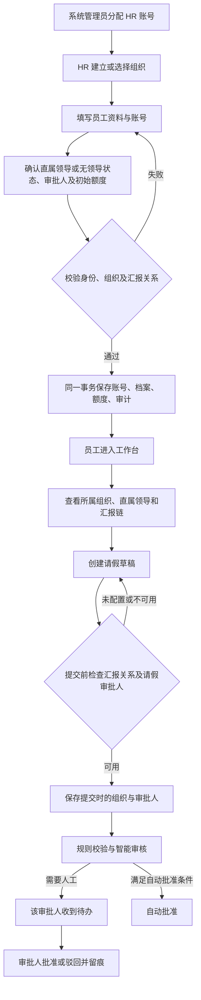

# 员工入职与组织流程

## 核心关系

一个账号绑定一个员工档案。`departmentId` 决定主组织，`managerId` 决定直属领导；`role` 引用权限角色目录，角色名称与实际权限分开保存。`noManager` 表示已确认没有直属领导，`leaveApproverId` 用于单独指定请假审批人。

| 数据 | 作用 | 规则 |
| --- | --- | --- |
| `users.id` | 稳定的员工身份，供申请和审批引用 | 入职时生成，调岗不变 |
| `users.username` | 分配给员工的账号 | 唯一，不区分大小写，建档后不可修改 |
| `users.employee_no` | HR 工号 | 唯一，不区分大小写 |
| `users.department_id` | 员工主组织 | 必须引用已有组织 |
| `positions` | 公司自定义职位目录 | 组织管理员新增，名称去除首尾空白、忽略英文大小写去重；各部门共享 |
| `permission_roles` | 公司自定义权限角色目录 | 保存名称和四项明确授权的权限，各部门共享 |
| `users.role` | 员工权限角色 ID | 必须为已有角色，名称和权限由后端解析，客户端不能伪造权限 |
| `users.title` | 员工职位名称 | 从职位目录选择，与权限角色独立 |
| `departments.parent_id` | 公司、部门、团队层级 | 禁止自引用和循环 |
| `departments.leader_id` | 组织负责人 | 可为空；指定时必须启用且具备 `leadTeam` 权限 |
| `users.manager_id` | 员工直属领导 | 可跨组织；禁止本人、下属、停用账号和无 `leadTeam` 权限人员 |
| `users.no_manager` | 明确无直属领导 | 为真时领导必须为空；旧数据空领导不会自动视为合法顶层人员 |
| `users.leave_approver_id` | 单独指定的请假审批人 | 可跨组织或选择下属；必须启用且具备 `approveLeave` 权限，不能是本人 |
| `users.status` | 账号启用或停用 | 停用后拒绝业务 API 访问 |
| `users.hired_at` | 实际入职日期 | 新入职必填且不晚于今天；旧数据未知日期留空 |
| `leave_balances` | 初始及已使用的假期额度 | 入职时由 HR 确认，建档后编辑员工资料不重置余额 |

组织负责人只用于入职时推荐直属领导。更换负责人不会自动改变现有员工的直属领导，跨部门汇报也必须明确保存到员工档案。

## 自定义职位与权限角色

HR 在新增或编辑员工的“职位名称”旁点击加号，输入公司自己的职位名称并保存，即可选用。职位独立保存，即使取消员工表单，也可在下一次建档或其他部门继续选择。员工已有职位会自动加入目录，旧账号和权限保持不变。通过员工 API 传入的新职位会随员工资料一起保存，事务失败时一起回滚。

“权限角色”旁的加号可新增公司自己的角色。填写角色名称后勾选权限并保存，表单自动选中新角色。角色独立保存，取消员工表单后仍可复用。名称首尾去空白，忽略英文大小写去重；创建写入审计。目前支持新增、选择角色，不提供修改或删除已有角色的接口，避免批量改变已分配员工的权限。

| 权限 | 用途 |
| --- | --- |
| `manageOrganization` | 维护组织、员工、职位和角色；查看停用员工、组织审计及请假详情 |
| `manageAccounts` | 分配及管理 HR、管理员账号，授予组织管理或账号管理权限；须同时拥有组织管理权限 |
| `leadTeam` | 可被指定为直属领导或组织负责人 |
| `approveLeave` | 可被指定为请假审批人，只能处理实际分配给自己的申请 |

每个启用账号均可查看组织和提交个人申请。新角色权限默认不勾选。员工不具备管理权限；主管具备负责人和请假审批权限；HR 具备组织管理、负责人、请假审批权限；系统管理员具备组织管理和账号管理权限，不自动具备审批权。只有系统管理员可以创建或分配具备 `manageOrganization` 或 `manageAccounts` 的角色，以及管理这些角色对应的其他账号。HR 仍可创建和分配普通业务角色。职位或角色名称本身不授予权限。

## 入职流程

HR 或具备组织管理权限的自定义角色在“组织与人员”中选择具体部门，点击部门标题旁的“添加人员”即可手动建档。表单默认带入当前部门及其负责人作为直属领导，保存后刷新该部门人员列表。在“全部人员”视图也可使用“新员工入职”入口。没有组织管理权限时，添加入口禁用并提示所需权限。

新员工入职接口支持省略 `managerId`，此时使用所选组织负责人；`noManager: true` 时不带入负责人。显式传入 `managerId: null` 不触发默认负责人。启用员工必须指定领导或显式设置 `noManager: true`，对所有角色规则相同。

董事长等顶层人员可选择“无直属领导”。这是完整、合法的汇报状态，列表和档案显示“无直属领导”，不会当成漏填。单独的“请假审批人”可以选择指定负责人、具备审批权限的下属等，不建立上下级关系，也不能选择本人。未指定时仍可入职和保存草稿，提交请假会提示配置审批人，草稿状态与审计不变。

有直属领导的员工默认跟随领导审批，也可通过 `leaveApproverId` 覆盖。领导没有审批权限时必须另选审批人才能提交。没有领导不会免审批或自动批准；配置审批人后仍遵循现有人工及智能审核规则。提交校验在任何流程状态变更之前执行。

入职事务任何一步失败，账号、额度和入职审计全部回滚。重复账号或工号不会覆盖既有员工。

## 调岗及停用

- 组织管理员编辑员工的组织、岗位、角色、直属领导或指定审批人后，新提交的申请使用更新后的配置，既有草稿在提交时取最新关系。
- 已提交的申请保存 `department_snapshot` 和 `submission_manager_id`（沿用原数据库列名，存储实际审批人）。组织改名、员工调岗或更换审批人，不改变该申请的组织显示及人工审批归属。
- 变更记录保存操作者、时间、变更前后资料。组织负责人变更也单独留痕。
- 停用人员或移除其负责人权限之前必须交接下属和组织职责；移除其审批权限之前必须替换相关员工的审批配置，处理完待审批及正在智能审核的申请。
- 停用员工前，员工自己的在途申请必须完成或撤回。已批准申请、历史审批与余额继续保留；重新启用不重复发放额度。
- 组织管理员不能停用自己或移除自己的组织管理权限；系统管理员不能移除自己的账号管理权限。HR 不能更改其他 HR 或管理员的资料、角色、密码或启停状态。角色变更立即撤销该账号原有会话。
- 旧库自动增加角色目录和新字段，内置权限不变；空领导保持“未指定”，需由管理员确认。重复启动不会重建角色或清除无领导状态、指定审批人。兼容旧客户端的员工更新请求：省略这两个新字段时保留原值。

## 权限

| 操作 | 员工 | 主管 | HR | 系统管理员 |
| --- | --- | --- | --- | --- |
| 查看组织与在职通讯录 | 是 | 是 | 是 | 是 |
| 查看个人组织、上级、直属下属 | 是 | 是 | 是 | 是 |
| 普通员工入职、调岗、密码重置、停用 | 否 | 否 | 是 | 是 |
| 分配和管理 HR / 管理员账号 | 否 | 否 | 否 | 是 |
| 新增和编辑组织、公司职位 | 否 | 否 | 是 | 是 |
| 新增、分配公司权限角色 | 否 | 否 | 仅普通业务权限 | 是 |
| 查看停用员工及组织变更审计 | 否 | 否 | 是 | 是 |
| 处理某一条请假审批 | 否 | 仅被指定的审批人 | 仅被指定的审批人 | 否 |

上表为内置角色，自定义角色以勾选权限为准。担任领导与审批权限独立。审批权限不授予所有人的审批权，接口同时检查当前角色、申请实际审批人及禁止自审。没有组织管理权限的用户不能通过接口新增角色或提升自己；无关且未参与审批的普通用户不能读取其他人的请假详情。

## API

| 接口 | 用途 |
| --- | --- |
| `GET /api/bootstrap` | 当前员工及角色权限、组织路径、领导、汇报链、直属下属、实际审批人、审批就绪状态及原因 |
| `GET /api/organization` | 组织树、职位目录、角色目录与人员目录 |
| `POST /api/positions` | HR 新增公司职位，保存创建审计 |
| `POST /api/roles` | 新增角色，提交名称和布尔权限；`manageAccounts` 省略默认否，其他三项必填；管理权限仅系统管理员可授予 |
| `GET /api/employees/:id` | 员工档案及汇报关系，HR 额外获得变更历史 |
| `POST /api/employees` | HR 入职，账号、档案和额度原子创建 |
| `PUT /api/employees/:id` | HR 更新资料、调岗或调整账号状态 |
| `POST /api/departments` | HR 新增组织 |
| `PUT /api/departments/:id` | HR 编辑层级或负责人 |
| `GET /api/departments/:id/actions` | HR 查看组织变更历史 |

上述 HR 维护接口也向具备 `manageOrganization` 权限的自定义角色开放，账号和角色操作仍受 `manageAccounts` 权限约束。密码重置接口为 `POST /api/employees/:id/password`，同样校验目标账号权限，不能通过调用接口绕过页面限制。

## 演示与生产

首次系统管理员通过本机 `python -m oa.manage bootstrap-admin --username admin` 初始化，支持已有 HR 凭据的旧库且不覆盖旧账号；已有管理员时禁止重复初始化。管理员分配 HR 账号，HR 再分配员工账号。已有员工在档案中开通登录或重置密码，首次登录必须修改初始密码。后端通过 HttpOnly Cookie 解析数据库会话，所有业务接口都需登录；`x-user-id` 和匿名默认身份已移除，智能体工具复用当前用户会话和 CSRF 校验。员工停用、角色变更、密码重置或修改时撤销旧会话，密码不写入审计。

本次实现一个员工一个主组织、最多一个直属领导、一个实际请假审批人。多组织兼职、多个权限角色叠加、按部门限制的数据权限、多人会签、临时代理审批、未来生效调岗、工龄折算额度及正式离职流程尚未实现。

## 验证

`npm test` 运行 Python pytest，覆盖入职到请假审批、自定义角色权限及越权拦截、合法无领导状态、独立审批与自审拦截、重复账号工号、无效组织领导、事务回滚、上下级循环、调岗及审批快照、停用与审批交接、组织负责人变更和旧库重复迁移。`npm run check` 执行 Python Ruff 与前端 TypeScript 检查，`npm run build` 执行 Python 语法编译检查与前端生产构建。
